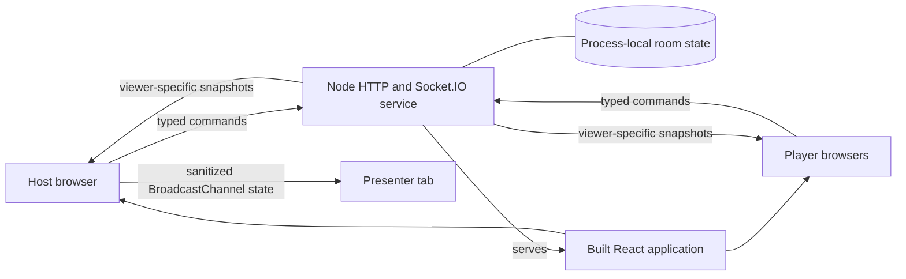

# Architecture

Wangz Game Night is a synchronous, host-led web application. Its architecture favors simple local events, server-authoritative game flow, and strict separation of public and private game information over horizontal scale or durable room history.

Use [the domain glossary](../CONTEXT.md) for product language and [the ADR directory](./adr/README.md) for decisions whose rationale must survive the current implementation.

## System shape

Production runs one container and one origin. The Node service serves the built React application, the health endpoint, and the Socket.IO endpoint. In development, Vite serves the frontend and proxies Socket.IO traffic to the Node service.

The presenter display is not another room connection. It is a same-origin tab on the host's device that receives a public projection through `BroadcastChannel`; the host tab must remain open.

## Authority and data flow

1. A host or player action becomes a typed Socket.IO command from `src/roomClient.ts`.
2. `server/index.ts` resolves the connection's room and role, validates the command, and delegates game-specific transitions where appropriate.
3. The server mutates the authoritative room state held in memory.
4. `snapshotFor` creates a separate `RoomSnapshot` for every connected viewer and `syncRoom` sends each projection to its socket.
5. React renders the latest snapshot. It does not decide whether an action was authorized or reveal data that the server withheld.

Shared event names, commands, results, and snapshot types live in `src/roomTypes.ts`. Changing the realtime contract therefore requires coordinated client, server, redaction, and integration-test updates.

## State ownership and lifetime

- The server owns rooms, rosters, team assignment, game state, buzzers, play/pass state, answering order, chats, and timers.
- A host connection owns its room. A host disconnect closes the room and notifies its players.
- A player identity may reconnect from the same browser session during a 30-second grace period; after that, its roster seat is removed.
- A room can return to its lobby for another game while retaining its code, player identities, teams, and—unless cleared—team huddles.
- A room code locates a room but is not an authentication secret.
- Rooms have no durable store. A server restart, replacement, or deployment removes every active room.

## Privacy boundaries

The server sends each connection only the state it may observe:

- The host can receive complete room configuration and both team huddles.
- A player receives only their team's huddle and a public Family Feud configuration without the game pack.
- Play/pass votes and Fast Money answers are projected according to the viewer's role and the current reveal phase.
- Game rules and authorization are enforced before mutation; hiding controls in React is never the security boundary.
- The presenter projection is built separately in `src/presenterChannel.ts` and contains audience-safe state only.

Any new private field must begin in authoritative server state and be deliberately added to the smallest valid viewer projection. Never broadcast secret state and rely on the interface to hide it.

## Game boundaries

`server/index.ts` coordinates rooms and realtime commands. Game-specific state transitions belong in focused modules:

- `server/spinSolve.ts` owns Spin & Solve rules and its public view.
- `server/fastMoney.ts` owns Fast Money phases, scoring, timers, authorization, and role-specific views.
- `src/feudTurnOrder.ts` owns Family Feud answering rotation.
- `src/sharedTimer.ts` owns the room-wide timer state machine.
- `src/feudGamePack.ts` owns Family Feud pack import, validation, and normalization.

These modules should accept explicit state and actor inputs and return a result or view. React components may orchestrate presentation, but should not become the source of game truth.

## Repository map

| Area | Responsibility |
| --- | --- |
| `src/App.tsx` and UI modules | Host, player, and presenter rendering and browser interaction |
| `src/roomClient.ts` | Typed Socket.IO client and reconnect intent |
| `src/roomTypes.ts` | Shared realtime contracts and viewer-facing state |
| `src/presenterChannel.ts` | Audience-safe presenter projection and same-device transport |
| `server/index.ts` | HTTP serving, room lifecycle, authorization, orchestration, and snapshot fan-out |
| `server/fastMoney.ts`, `server/spinSolve.ts` | Server-owned game engines and views |
| `server/*.test.ts`, `server/*.integration.ts` | Domain, authorization, privacy, reconnect, and realtime regression coverage |
| `scripts/verify.mjs` | Complete local and PR verification entry point |

## Deployment constraint

Production is manually scaled to one Cloud Run instance because every room belongs to one process. Session affinity cannot make multiple independent room maps safe. Horizontal scaling requires shared room state and cross-instance Socket.IO fan-out before increasing the instance count.

This trade-off is recorded in [ADR 0001](./adr/0001-keep-live-rooms-ephemeral-and-single-process.md). Deployment and instance replacement remain session-destructive until that decision is superseded.

## Keeping this document useful

- Update this overview when a runtime boundary, state owner, privacy boundary, or deployment topology changes.
- Update `CONTEXT.md` when domain language changes; keep implementation details out of that glossary.
- Add an ADR only for a hard-to-reverse, non-obvious decision made between real alternatives.
- Prefer links to source files and tests over duplicating detailed behavior here.
